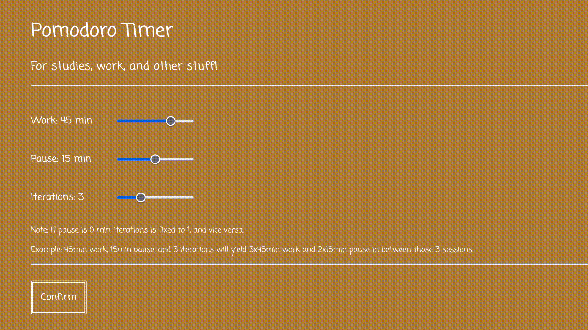

# Pomodoro Timer

🔸 En enkel vanilla JS nettside for en pomodoro timer (en teknikk hvor du deler inn arbeid i intervaller med pause). Brukt JS moduler, events og DOM manipulasjon. Siden har et responsivt design (funker på nett og mobil).

🔸Den er designet slik at man teknisk sett kan velge å jobbe uten noen pauser, selvom dette er litt utenfor hva en pomodoro er, men da blir antall sessions angitt til å være 1. Det kan hende dette endres senere om jeg koder mer på det.

🔸 Mye er ferdig, men jeg jobber ennå med logikken relatert til endring fra jobb til pause, osv. Så akkurat nå funker den ikke i praksis, men veldig snart. Vurderer også å lage litt mer grafikk, kanksje bedre CSS.