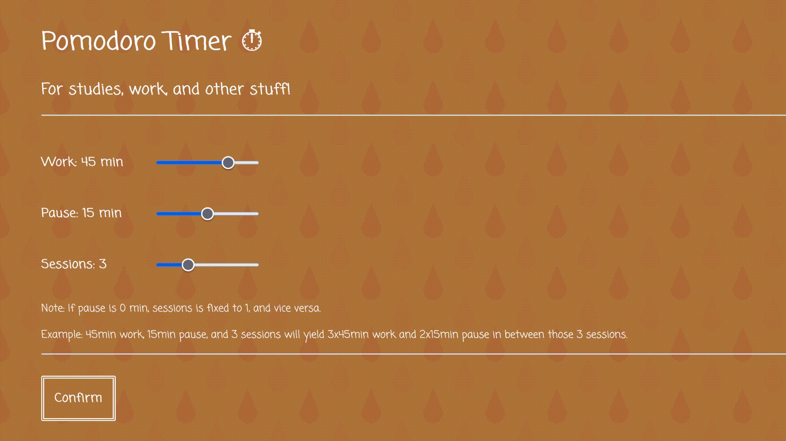
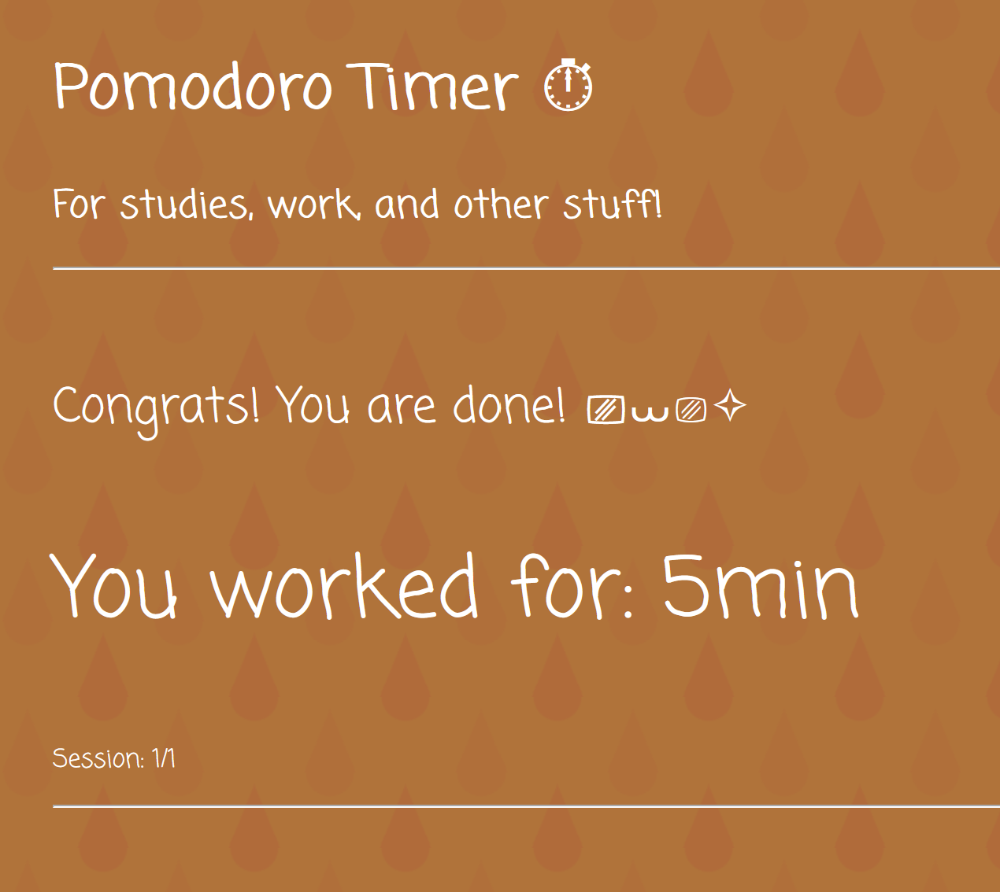

# Pomodoro Timer
Prøv den selv her: https://foxfrostbyte.github.io/Pomodoro-Timer-Website/

Start visning:

 

Etter en utført økt:

 

🔸 En ferdig vanilla JS nettside for en pomodoro timer (en teknikk hvor du deler inn arbeid i intervaller med pause). Brukt JS moduler, events og DOM manipulasjon. Siden har et responsivt design (funker på nett og mobil). Det er også implementert lyd slik du kan høre når du skal jobbe/ta pause/er ferdig.

🔸 Den er designet slik at man teknisk sett kan velge å jobbe uten noen pauser, selvom dette er litt utenfor hva en pomodoro er, men da blir antall sessions angitt til å være 1. Det kan hende dette endres senere om jeg koder mer på det.

🔸 Jeg har redigert litt og brukt bakgrunnsmønsteret (CSS) som jeg fant her: https://codepen.io/yoksel/pen/AxoQBd
